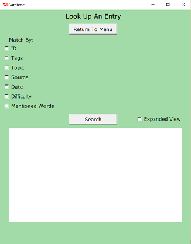
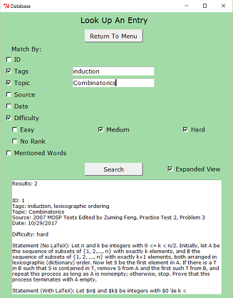
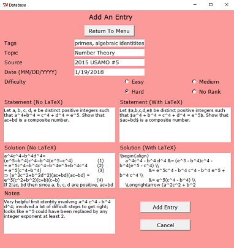

# Database

<p align="center">
  
</p>

### Running The Application
To download, you can clone the repository using this terminal command:
```
git clone https://github.com/wbchristerson/database.git
```

Alternatively, follow the instructions below to download to a hard drive:
* Click the green "Clone or download" button above then choose "Download ZIP".
* Find the folder `arcade-game-master` in your Downloads folder or wherever it was placed on your device.
* Right click and choose "Extract All".
* Open your browser and use `Ctrl + O` (for Windows machines) to open the file selector on your device.
* Go to `arcade-game-master`, enter `arcade-game-master` again, then select `index.html`. The game screen will appear.

### Structure
* The database opens with a menu page and has buttons sending the user to a search page ("Look Up An Entry"), a browse page ("Browse Entries"), an entry addition page ("Add An Entry"), and an entry editing page ("Edit An Entry").
* The search page can be used to look up entries based on various pieces of information listed below for the entry addition page as well as by an assigned ID. An expanded view for matching data entries is also available.
* The browse page lists all data entries in both a short form and an expanded view, similar to the search page.
* The entry addition page can be used to input information about the data entry. Since the main purpose of the database is to store mathematical puzzles and problems, accepted data includes the topic, key words (tags), the source, the date of completion, the level of difficulty, the problem/puzzle statement (both with and without LaTeX formatting), the solution (also both with and without LaTeX formatting), and additional notes.
* The entry editing page can be used to alter information for existing data entries. IDs cannot be changed.


### Design
The application begins with the menu shown above. All other page frames have return buttons back to this page. Clicking the "Look Up An Entry" button brings you to the following frame on the left below. As mentioned above, there are options to make queries based on ID in the database, tags (keywords), topic, source, date, difficulty, and mentioned words. When the corresponding check box is clicked, an entry widget appears to input data. Aside from the date and difficulty fields, a checked item without corresponding data will be interpreted as if the no filtering by that item were considered. If no items match the search conditions, then a message to this effect appears in the following text box. Otherwise, a series of search results appears, prefaced by a statement with the number of search results, as seen on right below. An "expanded view" check button can be used to toggle between abridged and complete forms of data entries. Warnings will be given for invalid or out of range IDs or dates. Note that the "mentioned words" and "source" fields will select entries which match any single searched word (even among many).

<p align="center">
  
  
</p>

Clicking the "Browse Entries" button brings you to the following frame on the left below. Clicking the browse button will provide a list of all entries in the database as seen on the right below. Similar to the search page, clicking the "expanded view" button will provide more information about items (though not all available information).

<p align="center">
  
  
</p>

Clicking the "Add An Entry" button brings you to the following frame on the left below. New entry data is filled in as matches the information on the search page as shown on the right below (aside from the ID, which the user has no control over). The entry can be cancelled or saved, after which time the user returns to the menu. Warnings are provided for invalid date entries. The collection of all data entries is kept in a JSON file as a Python list of "DataEntry" objects (which is stored in the form of a list of dictionaries for serialization).

<p align="center">
  
  
</p>

Clicking the "Edit An Entry" page brings you to the following frame on the left below. Input an ID and click the edit button to update an entry. The fields will be populated with the corresponding data for the entry with the provided ID as shown below in the right. If the ID is invalid or out of range then a warning appears. Similarly, warnings appear for updating a date to an invalid choice. When finished updating, click the save button. If you do not wish to keep the changes, cancel. In both cases you will return to the menu page.

<p align="center">
  
  
</p>

### Additional Details
* Do not include the pound symbol (#) in tags. They will confuse the program and incorrectly print the tags when entries are looked up.

### Remaining Issues
* I would like to be able to show the LaTeX-formatted statements and solutions to problems in rendered form if possible, since the current representation is a bit unaesthetic.
* I expect that there will be far more look up operations than entry addition operations, so that it would be most efficient to spend extra time when inputting the data to organize entries. For example, it would probably be helpful to implement a balanced tree structure based on date for when queries are made based on this category.
