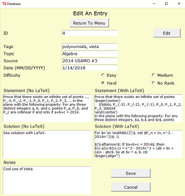

# Database

<p align="center">
  
</p>

### Overview

This project is a small-scale database that uses Python and the graphical user interface package, Tkinter. The database stores solutions to challenging mathematical puzzles and problems drawn from various sources, including mathematical olympiads; however, it can easily be adapted to store other information. To learn more about the project's structure, design, and how to download it, see below.

### Running The Application
Python must be installed on your computer to run the application. If you do not have it installed, you can download it for free. For details, see [this](https://www.python.org/downloads/ "Python Foundation Software Download Page") page. For reference, this project was created using Python version 3.1.

If you are running an operating system other than Windows, then you may have to download and install additional software to accommodate the Tkinter toolkit. To learn more or to trouble shoot, see these pages:
* [Tkinter on the Python Software Foundation Page](https://www.python.org/download/mac/tcltk/)
* [Tkinter on the Python wiki](https://wiki.python.org/moin/TkInter)
* [Why Didn't My Python Installation on Mac Include Tkinter?](https://stackoverflow.com/questions/36760839/why-my-python-installed-via-home-brew-not-include-tkinter)

To download the project, you can clone the repository using this terminal command:
```
git clone https://github.com/wbchristerson/database.git
```

Alternatively, follow the instructions below to download to a hard drive:
* Click the green "Clone or download" button above, then choose "Download ZIP".
* Find the folder `database-master` in your Downloads folder or wherever it was placed on your device.
* Right click and choose "Extract All".
* Go to `database-master`, enter `database-master` again, then double click `database.py`. The menu page will appear.

Note: The project comes with sample database entries to illustrate how the application works. If you wish to delete these entries and begin with a completely blank database, double click the file `delete_database.py`. A window will open, prompting you to confirm that you wish to delete all existing entries. To continue, type 'y'. To cancel, type 'n'. For a more aesthetically pleasing presentation of the original problems in the database, see `sample_problems.pdf`.


### Structure
The database opens with a menu page and the following buttons: "Look Up An Entry"; "Browse Entries"; "Add An Entry"; and "Edit An Entry".
  * "Look Up An Entry" searches for various pieces of information or by an assigned ID. An expanded view for matching data entries is also available.
  * "Browse Entries" lists all data entries in both a short form and an expanded view, similar to "Look Up An Entry".
  * "Write Page" adds data entries. Since the main purpose of the database is to store mathematical puzzles and problems accepted data include:
    - topic
    - key words (tags)
    - source
    - date of completion
    - level of difficulty
    - problem/puzzle statemente (with or without LaTeX formatting)
    - solution (with or without LaTeX formatting)
    - additional notes
  * "Edit An Entry" alters information about existing data entries. IDs cannot be changed.
The project was inspired by [this](https://artofproblemsolving.com/community/c5h1559064p9530694) post by v_Enhance on the website Art of Problem Solving.


### Design
The application begins with the menu shown above. All other page frames have return buttons back to this page. Clicking "Look Up An Entry" brings you to the following frame in the first image below. As mentioned above, you can make queries based on ID in the database or one of the "Add Entry" attributes described above. When the corresponding check box is clicked, an entry widget appears to input data. If no items match the search conditions, then a message to this effect appears in the following text box. Otherwise, a series of search results appears, as seen in the second image below. An "expanded view" check button can be used to toggle between abridged and complete forms of data entries. Warnings will be given for invalid or out-of-range IDs or dates.

Note that the "Mentioned Words" and "Source" fields will select
entries which match any single searched word (even among many).

<p align="center">
  
  
</p>

Clicking "Browse Entries" brings you to the following frame in the first image below. Clicking "Browse" will provide a list of all entries in the database as seen in the second image below. Similar to "Look Up An Entry", clicking the "Expanded View" button will provide more information about items.

<p align="center">
  
  
</p>

Clicking "Add An Entry" brings you to the following frame in the first image below. The fields for a new data entry match those on the "Look Up An Entry" page, as seen in the second image below. The entry can be cancelled or saved, after which you return to the menu. Warnings are provided for invalid date entries. The collection of all data entries is kept in a JSON file as a list of "DataEntry" objects (which is stored in the form of a list of Python dictionaries for serialization).

<p align="center">
  
  
</p>

Clicking "Edit An Entry" brings you to the following frame in the first image below. Input an ID and click "Edit" to update an entry. The fields will be populated with the corresponding data, as shown below in the second image. If the ID is invalid or out of range then a warning appears. Similarly, warnings appear for updating a date to an invalid choice. When finished updating, click the save button. If you do not wish to keep the changes, cancel. In both cases, you will return to the menu page.

<p align="center">
  
  
</p>


### Additional Details
* Do not include the pound symbol (#) in tags. They will confuse the program and incorrectly print the tags when entries are looked up.


### Remaining Issues
* I would like to be able to show the LaTeX-formatted statements and solutions to problems in rendered form if possible, since the current representation is a bit unaesthetic.
* I expect that there will be far more look up operations than entry addition operations, so that it would be most efficient to spend extra time when inputting the data to organize entries. For example, it would probably be helpful to implement a balanced tree structure based on date for when queries are made based on this category.
